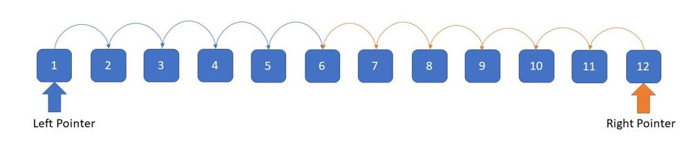
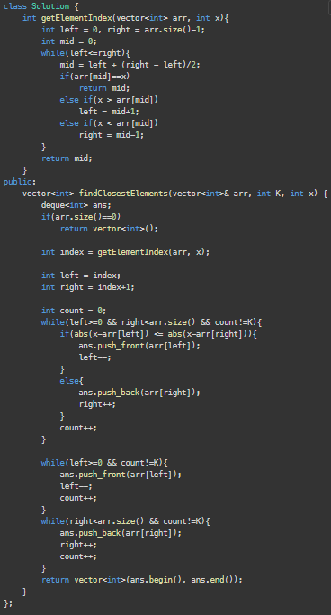
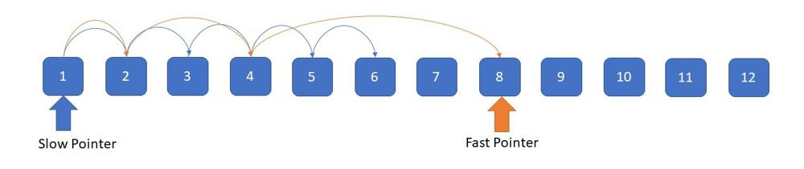
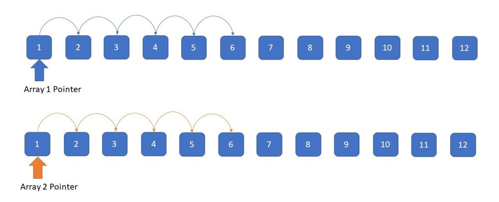
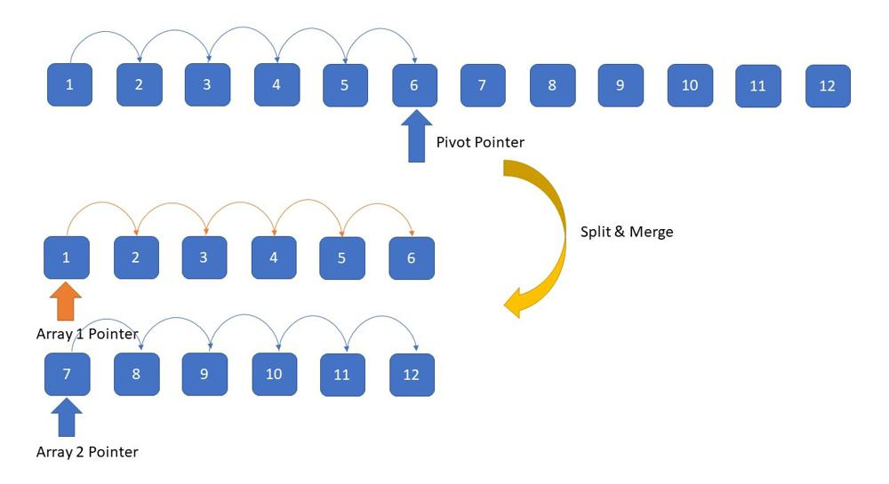

# Two Pointer Patterns

## 1. Running from Both Ends of an Array

Two pointers at the left and right ends of the array, moving them toward the center while processing.

### 2 Sum Problem

| # | Problem | Notes |
|---|---------|-------|
| 167 | Two Sum II - Input Array Is Sorted (\*) | Sorted array, classic L/R squeeze |
| 15 | 3Sum | Fix one, two-pointer on rest; skip duplicates |
| 18 | 4Sum | Fix two, two-pointer on rest |
| 1498 | Number of Subsequences That Satisfy the Given Sum Condition | Sort + count valid pairs with pow |
| 653 | Two Sum IV - Input is a BST | Inorder traversal + two pointers |
| 633 | Sum of Square Numbers | L=0, R=sqrt(c), squeeze toward target |
| 881 | Boats to Save People | Greedy pair heaviest with lightest |
| 1877 | Minimize Maximum Pair Sum in Array | Sort, pair smallest with largest |
| 923 | 3Sum With Multiplicity | Handle duplicate counts carefully |

### Trapping Water

| # | Problem | Notes |
|---|---------|-------|
| 42 | Trapping Rain Water (\*) | Track maxL/maxR, process shorter side |
| 11 | Container With Most Water | Move the shorter wall inward.   - The widest container (using first and last line) is a good candidate, because of its width. Its water level is the height of the smaller one of first and last line.   - All other containers are less wide and thus would need a higher water level in order to hold more water.   - The smaller one of first and last line doesn't support a higher water level and can thus be safely removed from further consideration. |

### Next Permutation

| # | Problem | Notes |
|---|---------|-------|
| 31 | Next Permutation (\*) | Find rightmost ascent, swap + reverse suffix |
| 556 | Next Greater Element III | Same as next permutation on digits |
| 1850 | Minimum Adjacent Swaps to Reach the Kth Smallest Number | Apply next permutation k times, count swaps |

### Reversing / Swapping

| # | Problem | Notes |
|---|---------|-------|
| 125 | Valid Palindrome | Skip non-alphanumeric, compare L and R |
| 344 | Reverse String (\*) | Swap L and R, move inward |
| 345 | Reverse Vowels of a String | Only swap when both pointers are on vowels |
| 680 | Valid Palindrome II | On mismatch, try skipping L or R |
| 917 | Reverse Only Letters | Skip non-letters, swap letters only |
| 27 | Remove Element | Slow pointer tracks write position |
| 75 | Sort Colors | Dutch National Flag: 3-way partition |
| 832 | Flipping an Image | Reverse each row + flip bits |
| 977 | Squares of a Sorted Array | Compare abs values from both ends |
| 905 | Sort Array By Parity | Swap evens to front, odds to back |
| 922 | Sort Array By Parity II | Even pointer and odd pointer independently |
| 969 | Pancake Sorting | Find max, flip to front, flip to position |
| 2000 | Reverse Prefix of Word | Find char, reverse prefix up to it |
| 541 | Reverse String II | Reverse every first k of each 2k block |
| 151 | Reverse Words in a String | Reverse whole string, then reverse each word |
| 557 | Reverse Words in a String III | Reverse each word in place |

### Others

| # | Problem | Notes |
|---|---------|-------|
| 948 | Bag of Tokens | Sort, spend power from left, gain score from right |
| 942 | DI String Match | D → pick from right, I → pick from left |
| 1750 | Minimum Length of String After Deleting Similar Ends | Trim matching chars from both ends |
| 1813 | Sentence Similarity III | Match words from front and back |
| 658 | Find K Closest Elements | Shrink window from both ends  |
| 821 | Shortest Distance to a Character | Two passes: left-to-right, right-to-left |

---

## 2. Slow & Fast Pointers

Two pointers starting from the left, the fast pointer advances ahead and gives feedback to the slow pointer.

### Linked List Operations

| # | Problem | Notes |
|---|---------|-------|
| 141 | Linked List Cycle (\*) | Floyd's: slow 1 step, fast 2 steps |
| 142 | Linked List Cycle II | After meeting, reset one to head, both move 1 step |
| 19 | Remove Nth Node From End of List | Fast advances n steps ahead of slow |
| 61 | Rotate List | Find length, link tail to head, cut at new position |
| 143 | Reorder List | Find mid, reverse second half, merge alternating |
| 234 | Palindrome Linked List | Find mid, reverse second half, compare |

### Cyclic Detection

| # | Problem | Notes |
|---|---------|-------|
| 287 | Find the Duplicate Number (\*) | Floyd's on index-value mapping |
| 457 | Circular Array Loop | Slow/fast on circular index jumps |

### Sliding Window / Caterpillar Method

| # | Problem | Notes |
|---|---------|-------|
| 795 | Number of Subarrays with Bounded Maximum (\*) | Track last valid and last invalid positions |
| 719 | Find K-th Smallest Pair Distance | Binary search on distance + two-pointer count |
| 1040 | Moving Stones Until Consecutive II | Sort, sliding window for min; endpoints for max |
| 1782 | Count Pairs of Nodes | Sort degrees, two-pointer + adjust for edges |
| 696 | Count Binary Substrings | Count consecutive groups, min of adjacent pairs |
| 532 | K-diff Pairs in an Array | Sort, two pointers maintaining diff = k |

### Rotation

| # | Problem | Notes |
|---|---------|-------|
| 1861 | Rotating the Box (\*) | Gravity simulation: fast scans, slow places stones |
| 189 | Rotate Array | Triple reverse: whole, first k, last n-k |

### String

| # | Problem | Notes |
|---|---------|-------|
| 443 | String Compression (\*) | Read pointer scans, write pointer compresses in-place |
| 1163 | Last Substring in Lexicographical Order | Two candidate pointers, compare and advance |

### Remove Duplicate

| # | Problem | Notes |
|---|---------|-------|
| 26 | Remove Duplicates from Sorted Array (\*) | Slow writes unique, fast scans ahead |
| 80 | Remove Duplicates from Sorted Array II | Allow at most 2: compare with slow[-2] |
| 82 | Remove Duplicates from Sorted List II | Skip all nodes with duplicate values |
| 1089 | Duplicate Zeros | Count zeros first, then fill from right to left |

### Others

| # | Problem | Notes |
|---|---------|-------|
| 1093 | Statistics from a Large Sample | Walk through counts to find median/mode |
| 763 | Partition Labels | Track last occurrence, extend partition end |
| 481 | Magical String | Generate sequence with slow/fast read-write |
| 825 | Friends Of Appropriate Ages | Sort + two-pointer or count-based approach |
| 845 | Longest Mountain in Array | Expand peak left and right |
| 1574 | Shortest Subarray to be Removed to Make Array Sorted | Find sorted prefix/suffix, merge with two pointers |

---

## 3. Running from Beginning of 2 Arrays / Merging 2 Arrays

Given 2 arrays or lists, process them with individual pointers advancing through each.

### Sorted Arrays

| # | Problem | Notes |
|---|---------|-------|
| 88 | Merge Sorted Array (\*) | Merge from the back to avoid shifting |
| 475 | Heaters | Sort both, advance heater pointer to cover each house |
| 1385 | Find the Distance Value Between Two Arrays | Sort arr2, binary search or two pointers |

### Intersections / LCA-like

| # | Problem | Notes |
|---|---------|-------|
| 160 | Intersection of Two Linked Lists (\*) | Two pointers swap to other head at end |
| 349 | Intersection of Two Arrays | Sort both, advance smaller pointer |
| 350 | Intersection of Two Arrays II | Sort both, advance both on match |

### Substring

| # | Problem | Notes |
|---|---------|-------|
| 28 | Find the Index of the First Occurrence in a String (\*) | Two pointers or KMP for pattern matching |
| 524 | Longest Word in Dictionary through Deleting | Check each word as subsequence with two pointers |
| 925 | Long Pressed Name | Match chars, allow repeated presses |
| 522 | Longest Uncommon Subsequence II | Check each string is not a subsequence of others |
| 165 | Compare Version Numbers | Split by '.', compare segment by segment |
| 1023 | Camelcase Matching | Two pointers: pattern pointer advances on match |
| 809 | Expressive Words | Group consecutive chars, compare group lengths |

### Median Finder

| # | Problem | Notes |
|---|---------|-------|
| 295 | Find Median from Data Stream (\*) | Two heaps: max-heap for lower, min-heap for upper |

### Meet-in-the-Middle / Binary Search

| # | Problem | Notes |
|---|---------|-------|
| 2035 | Partition Array Into Two Arrays to Minimize Sum Difference (\*) | Split in half, enumerate subsets, two-pointer merge |
| 1755 | Closest Subsequence Sum | Split array, enumerate both halves, sort + two-pointer |
| 1712 | Ways to Split Array Into Three Subarrays | Prefix sums + binary search / two pointers for bounds |
| 16 | 3Sum Closest | Fix one, two-pointer on rest, track closest sum |
| 611 | Valid Triangle Number | Sort, fix largest side, two-pointer count valid pairs |

### Others

| # | Problem | Notes |
|---|---------|-------|
| 581 | Shortest Unsorted Continuous Subarray | Find out-of-order min/max, then find boundaries |
| 826 | Most Profit Assigning Work | Sort both by difficulty, sweep with two pointers |
| 1754 | Largest Merge Of Two Strings | Greedily pick lexicographically larger suffix |
| 777 | Swap Adjacent in LR String | Two pointers validate L/R can only move in allowed direction |

---

## 4. Split & Merge of an Array / Divide & Conquer

Split the given list into 2 separate lists, then use two pointers to merge or unify them.

### Partition

| # | Problem | Notes |
|---|---------|-------|
| 86 | Partition List (\*) | Split into two lists by value, concatenate |

### Sorting

| # | Problem | Notes |
|---|---------|-------|
| 148 | Sort List (\*) | Find mid (slow/fast), split, merge sort both halves |
