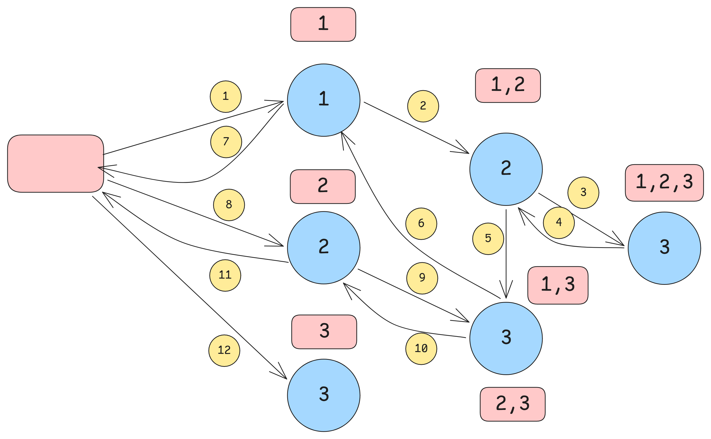

# Backtracking Patterns

## Pattern 1. Include/Exclude (The Binary Decision Pattern Pick / Don't Pick)

Problems where the core logic is a sequence of mutually exclusive choices: "Take it or Leave it", "Add (+) or Subtract (-)", or "Option A or Option B".

This pattern treats the problem as a sequence of binary decisions. For every element in the array, you have exactly two choices: you either include it in your current subset, or you exclude it. You make this decision for the first element, then move to the second, and so on.


**Problem: Print all subsets of an array**

Input: `A[] = [1,2,3]`

Output: `[1,2,3], [1,2], [1,3], [1], [2,3], [2], [3], []`


Recursion Tree — `nums = [1, 2, 3]`
```
Level 0:                      []  <-- Starting state (index 0)
                          /        \
                      Include 1     Exclude 1
                     /                \
Level 1:           [1]                 []  <-- Processing index 1
                 /    \              /    \
             Incl 2  Excl 2      Incl 2  Excl 2
             /          \          /          \
Level 2:  [1, 2]        [1]      [2]          []  <-- Base case (index 2 = len(nums))
```
Result: `[1,2,3], [1,2], [1,3], [1], [2,3], [2], [3], []`

**Note:** We only add the subset to our final result when we reach the base case (the bottom of the tree).

How it works step-by-step:
1. Start at index 0 with an empty subset [].
2. Branch Right: Include 1 (subset becomes [1]), move to index 1.
3. Branch Left: Exclude 1 (subset remains []), move to index 1.
4. Repeat this binary choice for 2 at index 1.
5. When the index equals the length of the array (index 2), record the current subset and backtrack.


```cpp
backtrack(nums, 0, current_subset, result);

void backtrack(vector<int>& nums, int index, vector<int>& current_subset, vector<vector<int>>& result) {
                       
    // Base case: We have made a yes/no decision for every element in the array
    if (index == nums.size()) {
        result.push_back(current_subset);
        return;
    }

    // Decision 1: Include the current element
    current_subset.push_back(nums[index]);
    backtrack(nums, index + 1, current_subset, result);
    current_subset.pop_back(); // Backtrack to undo the choice

    // Decision 2: Exclude the current element
    backtrack(nums, index + 1, current_subset, result);
}
```

### Classic Subsets (Take it or Leave it)
- 78\. Subsets (Print all/ One/ Count with sum = k)
- 1863\. Sum of All Subset XOR Totals
- 2044\. Count Number of Maximum Bitwise-OR Subsets
- 2597\. The Number of Beautiful Subsets

### Subsequence Building (Order matters, but strictly Left-to-Right)
- 491\. Non-decreasing Subsequences
- 1239\. Maximum Length of a Concatenated String with Unique Characters

### Strict A/B Selection (Two mutually exclusive actions)
- 22\. Generate Parentheses (Choice: Add `(` or Add `)`)
- 3211\. Generate Binary Strings Without Adjacent Zeros (Choice: Add `0` or Add `1`)
- 1980\. Find Unique Binary String (Choice: Add `0` or Add `1`)  [TODO]
- 401\. Binary Watch (Choice: Turn LED on or off)  [TODO]
- 494\. Target Sum (Choice: Assign `+` or Assign `-`)

### String & Character Mutation
- 784\. Letter Case Permutation (Choice: Uppercase or Lowercase)
- 320\. Generalized Abbreviation (Choice: Keep char or change to number) [TODO]
- 89\. Gray Code (Bit manipulation binary decisions) [TODO]
- 17\. Letter Combinations of a Phone Number (Mapping single digits to specific character sets)

### Target Sum (Unbounded)
- 39\. Combination Sum (Choice: Take number and stay to reuse, or leave and move on)

---

## Pattern 2.1. The For-Loop "Team" Pattern

This pattern treats the problem as building a sequence step-by-step. Instead of a binary decision, your current state represents a valid subset, and your "choices" are which remaining element to add next. You use a for loop to iterate through all valid candidates that can be added to the current state.

**Problem: Print all subsets of an array in lexicographicall order**

Input: `A[] = [1, 2, 3]`

Output: `[], [1], [1,2], [1,2,3], [1,3], [2], [2,3], [3]`

**Can we solve this by the previous include/exclude pattern?**
If we closely look at the previous answer we get:

`[1,2,3], [1,2], [1,3], [1], [2,3], [2], [3], []`

We want:

`[], [1], [1,2], [1,2,3], [1,3], [2], [2,3], [3]`


We need a a recursion lke the following:



Recursion Tree — `nums = [1, 2, 3]`

```
Level 0:                             []  <-- start_index = 0
                          
                          /          |          \
                   i=0 (add 1)  i=1 (add 2)  i=2 (add 3)
                        /            |            \
Level 1:              [1]           [2]           [3]
                     /   \           |
          i=1 (add 2)  i=2 (add 3) i=2 (add 3)
                  /        \         |
Level 2:       [1, 2]     [1, 3]   [2, 3]
                 |
            i=2 (add 3)
                 |
Level 3:     [1, 2, 3]

```

**Note:** In this pattern, every node in the tree is a valid subset, so we add the current state to our final result at the very beginning of the recursive call, not just at the base case.


```cpp
vector<vector<int>> allSubsetsLexicographical(){
    backtrack(nums, 0, current_subset, result);
    return result;
}

void backtrack(vector<int>& nums, int start_index, vector<int>& current_subset, vector<vector<int>>& result) {

    // Add the current state to the result immediately
    result.push_back(current_subset);
    
    for (int i = start_index; i < nums.size(); ++i) {
        // Make a choice
        current_subset.push_back(nums[i]);
        
        // Recurse (i + 1 to move forward, or just 'i' if reuse is allowed)
        backtrack(nums, i + 1, current_subset, result);
        
        // Undo choice
        current_subset.pop_back();
    }
};
```


## Pattern 2.2. The For-Loop "Team" Pattern - Conditioning

**Problem: Print Subsets Without Duplicates**
Given an integer array nums that may contain duplicates, return all possible subsets (the power set).
The solution set must not contain duplicate subsets. Return the solution in any order.

Example 1:

Input: nums = `[1,2,2]`

Output: `[[],[1],[1,2],[1,2,2],[2],[2,2]]`


- If we go for include/exclude, we get the following result.
`[[1,2,2],[1,2],[1,2],[1],[2,2],[2],[2],[]]`

- If we go for for loop based approach, we get the following result.
`[[],[1],[1,2],[1,2,2],[1,2],[2],[2,2],[2]]` Why? Lets look at its recursion tree:

```
Level 0:                                []  <-- start_index = 0
                            /           |           \
                     i=0 (add 1)   i=1 (add 2)   i=2 (add 2)
                          /             |             \
Level 1:                [1]            [2]            [2]
                       /   \            |
            i=1 (add 2)  i=2 (add 2)  i=2 (add 2)
                    /        \          |
Level 2:         [1, 2]     [1, 2]    [2, 2]
                   |
              i=2 (add 2)
                   |
Level 3:       [1, 2, 2]
```

At level 1, we pick 2(i=1) and form (1,2) and recur for the rest of the array. Once we come back from the recursion to level 1, we now goto i=2 and pick the second 2 and form the duplicate (1,2). 

How can we avoid this? - By checking if at the current level, did I see the current element previously or not.
At level 1, when i=2 the current element is nums[2] = 2. Did we see this before at this level? Yes. At i=1.
How can we check if this element has ocurred in the past? 
- By keeping a hash_set at every level.
- By sorting the original array so that duplicates become adjacent and before we choose the current element in the current_subset, we check if its a duplicate at this level - `if (i!=start_index && nums[i-1] == nums[i])`. If duplicate, then we skip the current element.

```cpp
void backtrack(vector<int>& nums, int start_index, vector<int>& current_subset, vector<vector<int>>& result) {                       
    // Add the current state to the result immediately
    result.push_back(current_subset);
    
    for (int i = start_index; i < nums.size(); i++) {
        
        // Check for duplicates
        if(i > start_index && nums[i-1] == nums[i])
            continue;

        // Make a choice
        current_subset.push_back(nums[i]);
        
        // Recurse (i + 1 to move forward, or just 'i' if reuse is allowed)
        backtrack(nums, i + 1, current_subset, result);
        
        // Undo choice
        current_subset.pop_back();
    }
}

vector<vector<int>> subsetsWithDup(vector<int>& nums) {
    vector<int> current_subset;
    vector<vector<int>> result;
    sort(nums.begin(), nums.end());
    backtrack(nums, 0, current_subset, result);
    return result;
}
```

How can we solve this using include/exclude?
- Sorting the original array so that duplicates become adjacent.
- While exlude the current element, we skip the next elements if they are a duplicate of the current element.

```
Level (Index)                            Current State
-------------                            -------------
Level 0                                       [ ]
                                           /       \
                                  Include 1         Exclude 1
                                 /                   \
Level 1                        [1]                   [ ]
                             /     \               /     \
                   Include 2a      Exclude 2a   Include 2a   Exclude 2a
                           /       (Skip 2b!)           /    (Skip 2b!)
Level 2                 [1, 2]            \            [2]           \
                     /      \            \          /   \           \
           Include 2b        Exclude 2b   \  Include 2b  Exclude 2b  \
                  /            \           \        /          \      \
Level 3 (Base) [1, 2, 2]        [1, 2]       [1]    [2, 2]       [2]    [ ]
```

```cpp
sort(nums.begin(), nums.end())
backtrack(nums, 0, current_subset, result);

void backtrack(vector<int>& nums, int index, vector<int>& current_subset, vector<vector<int>>& result) {
                       
    // Base case: We have made a yes/no decision for every element in the array
    if (index == nums.size()) {
        result.push_back(current_subset);
        return;
    }

    // Decision 1: Include the current element
    current_subset.push_back(nums[index]);
    backtrack(nums, index + 1, current_subset, result);
    current_subset.pop_back(); // Backtrack to undo the choice

    // Decision 2: Exclude the current element
    // Since we chose to exclude nums[index], we must also exclude 
    // all identical adjacent elements to prevent duplicate branches.
    int next_index = index + 1;
    while (next_index < nums.size() && nums[next_index] == nums[index]) {
        next_index++;
    }
    solve(nums, next_index, current_subset, result);
}
```


## Pattern 2.3. The For-Loop "Team" Pattern - Pruning

**Problem: Given two integers n and k, return all possible combinations of k numbers chosen from the range [1, n].**

Example 1:

Input: n = 4, k = 2 <br/>
Output: [[1,2],[1,3],[1,4],[2,3],[2,4],[3,4]] <br/>
Explanation: There are 4 choose 2 = 6 total combinations. <br/>
Note that combinations are unordered, i.e., [1,2] and [2,1] are considered to be the same combination. <br/>

A naive approach can be to generate all the subsets and add only those subsets whose size == 2. We can then solve it by include/exclude, for-loop based.

Do we really need to generate all the subsets??? 
- For the include/exclude approach, since we get the answer at the leaf of the recursion tree, and we donot have any way to control the size of the current_subset, we need to generate all the subsets.
- For the for-loop based approach, we can prune the tree early. Lets see the recursion tree of the for-loop based approach.

```
Level 0:                             []  <-- start_index = 0
                          
                          /          |          \
                   i=0 (add 1)  i=1 (add 2)  i=2 (add 3)
                        /            |            \
Level 1:              [1]           [2]           [3]
                     /   \           |
          i=1 (add 2)  i=2 (add 3) i=2 (add 3)
                  /        \         |
Level 2:       [1, 2]     [1, 3]   [2, 3]
                 |
            i=2 (add 3)
                 |
Level 3:     [1, 2, 3]

```
If we carefully look into the tree, we observe 
- at level 1, all the subsets have size = 1.
- at level 2, all the subsets have size = 2.
- at level 3, all the subsets have size = 3.

So at level k the subset size will be k and any level more than k will have subset size more than k. So when we get a subset of size k, we know we are at level k. We can return from this level and skip exploring the levels > k. 

```cpp
void backtrack(vector<int>& nums, int start_index, vector<int>& current_combo, int k,        vector<vector<int>>& result) {

    // Base case: Found a valid combination of size k
    if (current_combo.size() == k) {
        result.push_back(current_combo);
        return;
    }
    
    for (int i = start_index; i < nums.size(); ++i) {
        // Optional: Skip duplicates
        if (i > start_index && nums[i] == nums[i - 1]) continue;
        
        // Make a choice
        current_combo.push_back(nums[i]);
        
        // Recurse (i + 1 to move forward, or just 'i' if reuse is allowed)
        backtrack(nums, i + 1, current_combo, k, result);
        
        // Undo choice
        current_combo.pop_back();
    }
};
```

**If we closely look into the include/exclude and the for-loop pattern, we observe that in for-loop pattern we donot
have the exclude code written. Then how does for-loop code excludes?**

This is a great question. In the for loop pattern, we don't need a separate "exclude" recursive call because the exclusion happens implicitly through the loop's iteration.

Here is the breakdown of why the two patterns behave differently:

**1. The Include/Exclude Pattern (Binary Tree)**
In this pattern, you are making a strict binary (Yes/No) decision for *one specific element at a time*.
- "Yes, I will include index `i`" `-> solve(i + 1, ...)` (after pushing)
- "No, I will exclude index `i`" `-> solve(i + 1, ...)` (without pushing)
Because there is no loop to advance the index, you *must* make a second recursive call to tell the algorithm to skip the current element and evaluate the next one.

**2. The For-Loop Pattern (N-ary Tree)**
In this pattern, the `for` loop itself handles the "skipping".
When you are at `idx = 1`, the loop does the following:

- i = 1: It pushes `1`, recurses down, and when it comes back up, it calls `pop_back()` to remove `1`.

- i = 2: The loop increments. It now pushes `2` and recurses down.

By simply popping `1` off and advancing the loop to `2`, the algorithm has implicitly excluded `1` from this new branch! You don't need to write an explicit `solve()` call to skip elements because the `for` loop's natural progression (`i++`) is already skipping the previous elements as it moves forward horizontally across the tree.

In short:
- Include/Exclude uses recursion to move forward when you don't pick an item.
- The For-Loop uses iteration (`i++`) to move forward when you don't pick an item.


### Subsets
- Subsets in Lexicographical Order
### Classic Combinations (Pick exactly k elements)
- 77\. Combinations
- 216\. Combination Sum III
- 254\. Factor Combinations [TODO]
- 2178\. Maximum Split of Positive Even Integers

### Handling Duplicates (Sorting + Skip Logic)
- 90\. Subsets II
- 40\. Combination Sum II

### String & Character Combinations
- 1079\. Letter Tile Possibilities
- 1087\. Brace Expansion
- 1096\. Brace Expansion II [TODO]
- 1286\. Iterator for Combination

---

## 3. Permutations (The "Ordering" Pattern)

Problems where order matters. You must evaluate every element for every position, iterating from 0 each time while tracking used elements.

For permutations, your thought process is: "*I have an empty slot. Out of all the elements I haven't used yet, which one should I put here?*" Because you can pick any unused element (not just elements strictly to the right of your current index), you use a `for` loop that always starts from 0, but you use a boolean array (or a set) called `used_in_current_perm` to keep track of what is already in your current permutation.


```cpp
class PermutationsPattern {
public:
    vector<vector<int>> solvePermutations(vector<int>& nums) {
        vector<vector<int>> result;
        vector<int> current_perm;
        vector<bool> used_in_current_perm(nums.size(), false);
        
        backtrack(nums, used_in_current_perm, current_perm, result);
        return result;
    }

private:
    void backtrack(const vector<int>& nums, vector<bool>& used_in_current_perm, 
                   vector<int>& current_perm, vector<vector<int>>& result) {
        // Base case: The arrangement is complete
        if (current_perm.size() == nums.size()) {
            result.push_back(current_perm);
            return;
        }
        
        // ALWAYS start from 0 to evaluate all elements
        for (int i = 0; i < nums.size(); ++i) {
            // Skip elements we've already placed in the current permutation
            if (used_in_current_perm[i]) continue;
            
            // Make a choice
            current_perm.push_back(nums[i]);
            used_in_current_perm[i] = true;
            
            // Recurse
            backtrack(nums, used_in_current_perm, current_perm, result);
            
            // Undo choice
            used_in_current_perm[i] = false;
            current_perm.pop_back();
        }
    }
};
```

### Recursion Tree — `nums = [1, 2, 3]`

The for-loop always starts from index 0 and skips `used_in_current_perm` elements. Every element is considered for every position.

```
                                          solve(perm=[], used_in_current_perm={})
                            /                               |                              \
                       pick 1                            pick 2                            pick 3
                  solve([1],{1})                     solve([2],{2})                     solve([3],{3})
                  /             \                /                  \               /                  \
             pick 2            pick 3           pick 1            pick 3          pick 1               pick 2
          solve([1,2]{1,2}) solve([1,3]{1,3}) solve([2,1]{2,1}) solve([2,3]{2,3}) solve([3,1]{3,1}) solve([3,2]{3,2})
              |                     |               |                   |                 |                |
           pick 3                 pick 2          pick 3              pick 1           pick 2            pick 1
          [1,2,3]✓               [1,3,2]✓        [2,1,3]✓           [2,3,1]✓         [3,1,2]✓          [3,2,1]✓
```

Result: `[1,2,3], [1,3,2], [2,1,3], [2,3,1], [3,1,2], [3,2,1]`  (3! = 6 permutations)

### Classic Array Permutations
- 46\. Permutations
- 47\. Permutations II (Handling duplicates)
- 3437\. Permutations III

### Number & Digit Formation
- 357\. Count Numbers with Unique Digits
- 949\. Largest Time for Given Digits
- 967\. Numbers With Same Consecutive Differences
- 1088\. Confusing Number II
- 2048\. Next Greater Numerically Balanced Number
- 2375\. Construct Smallest Number From DI String
- 2992\. Number of Self-Divisible Permutations

### Array/Sequence Index Constraints
- 526\. Beautiful Arrangement (Number must divide index or vice versa)
- 996\. Number of Squareful Arrays (Adjacent sums must be perfect squares)
- 1415\. The k-th Lexicographical String of All Happy Strings of Length n
- 1718\. Construct the Lexicographically Largest Valid Sequence

### String & Binary Cycle Permutations
- 267\. Palindrome Permutation II
- 1238\. Circular Permutation in Binary Representation

---

## 4. String Partitioning (The "Slicing" Pattern)

Problems where you take a sequence and determine valid indices to "slice" it into contiguous, valid chunks.

```cpp
class StringPartitionPattern {
public:
    vector<vector<string>> solvePartitioning(string s) {
        vector<vector<string>> result;
        vector<string> current_partitions;
        
        backtrack(s, 0, current_partitions, result);
        return result;
    }

private:
    void backtrack(const string& s, int start_index, 
                   vector<string>& current_partitions,
                   vector<vector<string>>& result) {
        // Base case: Reached the end of the string
        if (start_index == s.length()) {
            result.push_back(current_partitions);
            return;
        }
        
        for (int i = start_index; i < s.length(); ++i) {
            // Extract the current slice [startIndex...i]
            string current_slice = s.substr(start_index, i - start_index + 1);
            
            // Only recurse if the current slice is valid
            if (isValidSlice(current_slice)) {
                current_partitions.push_back(current_slice);
                backtrack(s, i + 1, current_partitions, result);
                current_partitions.pop_back(); // Undo choice
            }
        }
    }
    
    bool isValidSlice(const string& slice) {
        // Implement your validity check here
        return true; 
    }
};
```

### Recursion Tree — Palindrome Partitioning `s = "aab"`

The for-loop tries every possible slice starting at `start_index`. Only palindromic slices proceed.

```
                                         solve(start=0, [])
                         /                       |                  \
                    slice "a"               slice "aa"          slice "aab"
                  (palindrome✓)            (palindrome✓)     (not palindrome✗)
                       |                        |
              solve(start=1,["a"])      solve(start=2,["aa"])
                /          \                    |
          slice "a"     slice "ab"          slice "b"
        (palindrome✓) (not palin✗)        (palindrome✓)
              |                                 |
     solve(start=2,["a","a"])         solve(start=3,["aa","b"])
              |                                 |
          slice "b"                         BASE CASE
        (palindrome✓)                    ➜ ["aa","b"] ✓
              |
     solve(start=3,["a","a","b"])
              |
          BASE CASE
         ➜ ["a","a","b"] ✓
```

Result: `["a","a","b"], ["aa","b"]`


**What is the difference between the String Slicing Pattern and the Interval DP pattern? Both looks similar?**

Backtracking partitioning explores different ways to split a sequence by making a choice and moving forward, while Interval DP solves problems by combining optimal solutions of smaller subarrays.

**1. The Core Objective: "Cutting" vs "Merging"**

**String Slicing (1D Backtracking)**
- **The Goal:** You want to cut a string into valid pieces, going strictly from left to right.
- **The Analogy:** Slicing a loaf of bread. You cut a slice from the left side, put it on a plate, and then ask, "How do I cut the rest of this loaf?"
- **Order of operations:** Does not matter. Cutting the string at index 2 and then index 4 is the exact same as cutting it at index 4 and then index 2.

**Interval DP**
- **The Goal:** You are usually given an array of items and asked to merge them, combine them, or destroy them until only one remains.
- **The Analogy:** A tournament bracket. You merge A and B, and you merge C and D. Then you merge the winners.
- **Order of operations:** Crucial. `(A + B) + C` might cost `$10`, but `A + (B + C)` might cost `$100`. You are trying to find the optimal sequence of merges.

**2. The State Representation (1D vs 2D)**

**String Slicing (1D State)**
You only need one pointer: start_index.
Because you always process left-to-right, everything to the left of start_index is "done", and you only care about the `suffix [start_index ... end]`.

**Interval DP (2D State)**
You need two pointers: i and j (representing a contiguous `interval [i, j]`).
Because the order of operations matters, the "last" merge might happen right in the middle of the array. You have to isolate sub-segments of the array and solve them independently.

**3. Recursion and Code Structure**

This is the easiest way to spot the difference. In 1D Slicing, you slice off a prefix and make one recursive call for the remaining suffix. In Interval DP, you guess a split point k and must make two recursive calls (Left and Right) to solve the independent halves.

**String Slicing (1D State)**

Example: Partitioning the string "aba" into all possible palindromes.

```

                                solve(start=0)  ["aba"]
                              /                 \
                 slice "a"  /                     \ slice "aba"
                           /                       \
                  solve(start=1) ["ba"]         solve(start=3) []
                   /             \               (Base Case: Reached End)
         slice "b"/               \ slice "ba"
                 /                 \
      solve(start=2) ["a"]         (✗ Invalid slice, Pruned)
               /
     slice "a"/
             /
    solve(start=3) []
  (Base Case: Reached End)
```

Code Structure:

```
string slice = s[start_index ... i];
solve(i + 1); // Only solve the remaining right side
```

**Interval DP (2D State)**

Example: Palindrome Partitioning II (Find the MINIMUM cuts to make all substrings palindromes) for the string "abac".

Here, the state solve(i, j) represents the minimum cuts needed for the substring s[i...j]. If s[i...j] is already a palindrome, the cost is 0. Otherwise, we try every split k.

```
                                         solve(0, 3) "abac"
                                  /              |               \
                                /                |                 \
                 split k=0    /       split k=1  |      split k=2    \
                            /                    |                     \
                   "a" | "bac"                "ab" | "ac"                "aba" | "c"
                   /         \                /         \                /         \
         solve(0,0)  +   solve(1,3) + 1   solve(0,1) + solve(2,3) + 1  solve(0,2) + solve(3,3) + 1
          (Base: 0)       /        \      (Not Palin)  (Not Palin)     (Base: 0)    (Base: 0)
                      "b"|"ac"   "ba"|"c"                              *Palindrome!* *Palindrome!*
                                                                       Total Cuts = 0 + 0 + 1 = 1
```
Code Structure:
```
// Base Case: No cuts needed if the entire interval is a palindrome
if (isPalindrome(s, i, j)) return 0;

int min_cuts = INFINITY;
// Try every possible split point k
for (int k = i; k < j; k++) {
    int left_cuts = solve(i, k);       // Solve the left half
    int right_cuts = solve(k + 1, j);  // Solve the right half
    
    // Total cuts = left cuts + right cuts + 1 (the cut we made at k)
    min_cuts = min(min_cuts, left_cuts + right_cuts + 1);
}
return min_cuts;
```

**4. Efficiency and Time Complexity**

- **Backtracking Partitioning:** Typically runs in exponential time, often `O(2^n)` or `O(n!)`.
- **Interval DP:** Runs in polynomial time, typically `O(n^3)` or `O(n^2)` due to memoization.

**5. Memory Overhead**

- **Backtracking Partitioning:** Uses \(O(n)\) auxiliary space for the recursion stack.
- **Interval DP:** Requires an \(O(n^2)\) table to store the results of the subproblems.

**6. Best Use Cases**

- **Backtracking Partitioning:** When you need to generate, print, or count all valid partitions (e.g., Palindrome Partitioning).
- **Interval DP:** When you need to find an optimal value like a minimum, maximum, or total count by merging adjacent elements (e.g., Matrix Chain Multiplication).

**7. Summary & Problem Identification**

| Feature | String Slicing (Backtracking / 1D DP) | Interval DP (MCM / 2D DP) | 
| ----- | ----- | ----- | 
| **Typical Goal** | Find all valid partitions, or check if a valid partition exists. | Find the max/min cost to reduce/divide the sequence. | 
| **State** | `solve(start_index)` | `solve(i, j)` | 
| **Recursive Calls** | 1 per loop iteration. | 2 per loop iteration. | 
| **Code Structure** | Build prefix `[start...i]`, recurse on `[i+1...end]`. | Guess split `k`, recurse on `[i...k]` and `[k+1...j]`. |

### Palindromes & Distinct Properties
- 131\. Palindrome Partitioning
- 2767\. Partition String Into Minimum Beautiful Substrings (Powers of 5)
- 1593\. Split a String Into the Max Number of Unique Substrings

### Word Breaking & Sentence Parsing
- 139\. Word Break
- 140\. Word Break II
- 472\. Concatenated Words
- 1258\. Synonymous Sentences

### Formatting (IPs & Coordinates)
- 93\. Restore IP Addresses
- 816\. Ambiguous Coordinates

### Math & Number Splitting
- 282\. Expression Add Operators
- 306\. Additive Number
- 842\. Split Array into Fibonacci Sequence
- 1849\. Splitting a String Into Descending Consecutive Values
- 2698\. Find the Punishment Number of an Integer

---

## 5. 2D Grid & Graph Search (The "Pathfinding" Pattern)

Problems navigating a matrix, chess board, or explicit graph where you must temporarily mark nodes/cells as "visited" before recursing into adjacent directions.

```cpp
class GridSearchPattern {
private:
    // Directions: Right, Down, Left, Up
    int dr[4] = {0, 1, 0, -1};
    int dc[4] = {1, 0, -1, 0};
    int ROWS, COLS;

public:
    void solveGrid(vector<vector<char>>& grid) {
        ROWS = grid.size();
        COLS = grid[0].size();
        
        for (int r = 0; r < ROWS; ++r) {
            for (int c = 0; c < COLS; ++c) {
                backtrack(grid, r, c);
            }
        }
    }

private:
    void backtrack(vector<vector<char>>& grid, int r, int c) {
        // Base cases: Out of bounds or visited/invalid cell
        if (r < 0 || c < 0 || r >= ROWS || c >= COLS || grid[r][c] == '#') {
            return;
        }
        
        // Check if goal is reached here...
        
        // 1. Store original value and mark cell as visited
        char original_value = grid[r][c];
        grid[r][c] = '#'; 
        
        // 2. Explore all adjacent directions
        for (int i = 0; i < 4; ++i) {
            backtrack(grid, r + dr[i], c + dc[i]);
        }
        
        // 3. Backtrack: Restore original value
        grid[r][c] = original_value;
    }
};
```

### Recursion Tree — Word Search `board`, `word = "CAT"`

Starting from cell `(0,0)` containing `'C'`. At each step, try all 4 directions; only matching characters proceed.

```
    Board:            C  A  R
                      X  T  B

                      backtrack(0,0) match 'C' ✓
                     /      |       \       \
                  Right    Down     Left     Up
                 (0,1)    (1,0)   (0,-1)   (-1,0)
                'A'✓      'X'✗    OOB✗     OOB✗
                  |
          backtrack(0,1) match 'A' ✓
           /      |       \       \
        Right    Down     Left     Up
        (0,2)   (1,1)   (0,0)   (-1,1)
        'R'✗    'T'✓   visited✗  OOB✗
                  |
          backtrack(1,1) match 'T' ✓
                  |
            word complete → found "CAT" ✓
```

Cells are marked `'#'` (visited) on the way down and restored on the way back up.

### Matrix Pathfinding & Traversals
- 980\. Unique Paths I
- 980\. Unique Paths II
- 980\. Unique Paths III
- 1219\. Path with Maximum Gold
- 489\. Robot Room Cleaner
- 2850\. Minimum Moves to Spread Stones Over Grid

### Word Search on a Grid
- 79\. Word Search
- 212\. Word Search II (Usually combined with a Trie)

### Board Games (Placement & Movement Constraints)
- 51\. N-Queens
- 52\. N-Queens II
- 37\. Sudoku Solver
- 2664\. The Knight's Tour
- 2056\. Number of Valid Move Combinations On Chessboard

### Explicit Graph & Tree Paths
- 113\. Path Sum II
- 257\. Binary Tree Paths
- 988\. Smallest String Starting From Leaf
- 797\. All Paths From Source to Target
- 2065\. Maximum Path Quality of a Graph

---

## 6. Bin Packing & Complex State Space (The "Distribution" Pattern)

The most complex category. You aren't just forming one group; you are assigning multiple items across `k` different buckets/states, requiring heavy tree-pruning to avoid Time Limit Exceeded (TLE).

```cpp
class BinPackingPattern {
public:
    bool solveBinPacking(vector<int>& items, int k_buckets, int target_capacity) {
        // Sort items descending to place largest items first (Optimization trick)
        sort(items.begin(), items.end(), greater<int>());
        vector<int> buckets(k_buckets, 0);
        
        return backtrack(items, buckets, 0, target_capacity);
    }

private:
    bool backtrack(const vector<int>& items, vector<int>& buckets, 
                   int item_index, int target_capacity) {
        // Base case: All items have been placed
        if (item_index == items.size()) {
            return true;
        }
        
        int current_item = items[item_index];
        
        for (int j = 0; j < buckets.size(); ++j) {
            // Prune: If adding this item exceeds capacity, skip
            if (buckets[j] + current_item > target_capacity) continue;
            
            // Make choice
            buckets[j] += current_item;
            
            // Recurse
            if (backtrack(items, buckets, item_index + 1, target_capacity)) {
                return true; 
            }
            
            // Undo choice
            buckets[j] -= current_item;
            
            // CRITICAL PRUNING: If placing in an empty bucket failed, 
            // placing in subsequent empty buckets will also fail.
            if (buckets[j] == 0) break;
        }
        
        return false;
    }
};
```

### Recursion Tree — `items = [3, 2, 1]`, `k = 2` buckets, `target = 3`

Each item is tried in every bucket. Pruning skips buckets that would overflow and duplicate empty buckets.

```
                        solve(item=0, buckets=[0,0])
                          /                    \
                  3→bucket[0]              3→bucket[1]
              buckets=[3,0]              (bucket[0] is empty & failed → PRUNE)
                    |
            solve(item=1, [3,0])
              /              \
        2→bucket[0]      2→bucket[1]
       [5,0] → 5>3 PRUNE   [3,2]
                              |
                    solve(item=2, [3,2])
                      /              \
                1→bucket[0]      1→bucket[1]
               [4,2] → 4>3 PRUNE   [3,3] → 3>3 PRUNE
                              
                    ... backtrack and try other orderings ...

    With sorted input [3,2,1]:
        bucket[0]=3, bucket[1]=2+1=3  →  [3, 3] ✓  (both equal target)
```

The "empty bucket" pruning is key: if placing an item in one empty bucket fails, all other empty buckets are identical, so we `break`.

### Bin Packing (Distributing items into k equal/constrained buckets)
- 473\. Matchsticks to Square (4 equal buckets)
- 698\. Partition to K Equal Sum Subsets
- 1723\. Find Minimum Time to Finish All Jobs
- 1986\. Minimum Number of Work Sessions to Finish the Tasks
- 2305\. Fair Distribution of Cookies
- 1655\. Distribute Repeating Integers

### Matching, Pairing & Operations
- 1799\. Maximize Score After N Operations
- 1947\. Maximum Compatibility Score Sum
- 1601\. Maximum Number of Achievable Transfer Requests
- 465\. Optimal Account Balancing

### Puzzles & Complex Transitions
- 126\. Word Ladder II
- 351\. Android Unlock Patterns
- 679\. 24 Game
- 756\. Pyramid Transition Matrix
- 773\. Sliding Puzzle
- 1240\. Tiling a Rectangle with the Fewest Squares
- 1307\. Verbal Arithmetic Puzzle
- 301\. Remove Invalid Parentheses
- 691\. Stickers to Spell Word

### Complex Subset Selection (Multiple overlapping conditions)
- 1255\. Maximum Score Words Formed by Letters
- 2397\. Maximum Rows Covered by Columns
- 2708\. Maximum Strength of a Group
- 2151\. Maximum Good People Based on Statements
- 2212\. Maximum Points in an Archery Competition
- 638\. Shopping Offers

### Generators & Highly Specific Math/State Search
- 95\. Unique Binary Search Trees II
- 411\. Minimum Unique Word Abbreviation
- 425\. Word Squares
- 3799\. Word Squares II
- 681\. Next Closest Time
- 1066\. Campus Bikes II
- 1215\. Stepping Numbers
- 1467\. Probability of a Two Boxes Having The Same Number of Distinct Balls
- 2002\. Maximum Product of the Length of Two Palindromic Subsequences
- 2014\. Longest Subsequence Repeated k Times
- 2152\. Minimum Number of Lines to Cover Points
- 3348\. Smallest Divisible Digit Product II
- 3376\. Minimum Time to Break Locks I
- 3646\. Next Special Palindrome Number
- 3669\. Balanced K-Factor Decomposition
