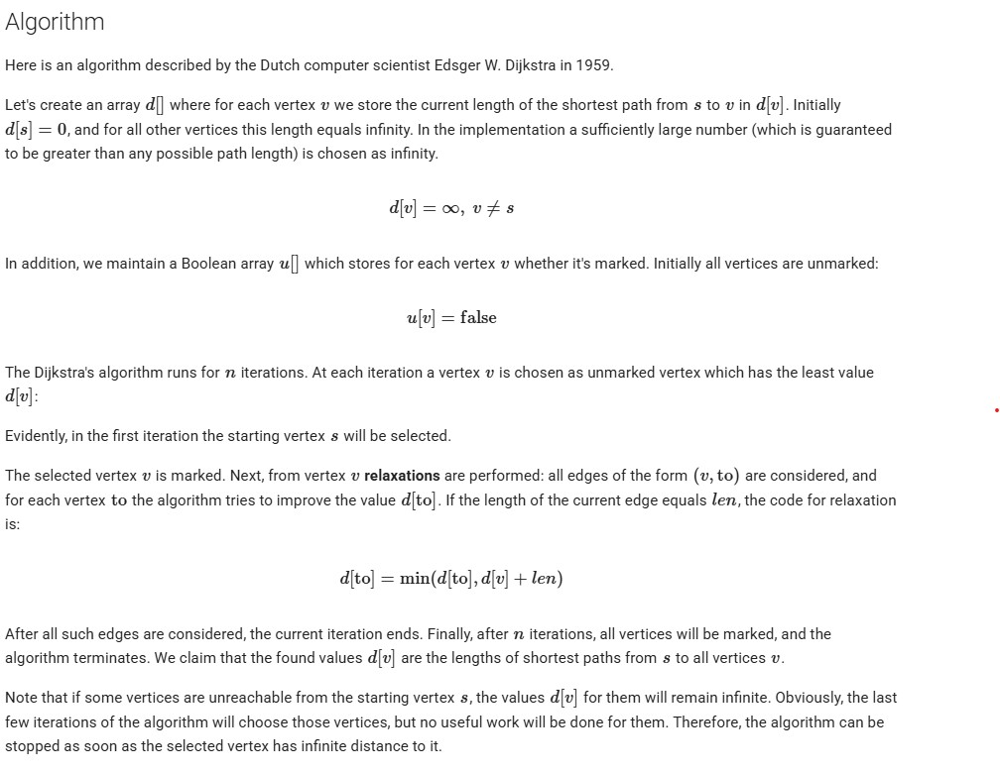

### Single Source Shortest Path


Given a weighted, undirected and connected graph where you have given adjacency list adj. You have to find the shortest distance of all the vertices from the source vertex src, and return a list of integers denoting the shortest distance between each node and source vertex src.
Note: The Graph doesn't contain any negative weight edge.

Input: adjList = [[[1, 9]], [[0, 9]]], src = 0
Output: [0, 9]
Explanation: The source vertex is 0. Hence, the shortest distance of node 0 is 0 and the shortest distance from node 0 to 1 is 9

Input: adjList = [[[1, 1], [2, 6]], [[2, 3], [0, 1]], [[1, 3], [0, 6]]], src = 2
Output: [4, 3, 0]
Explanation: For nodes 2 to 0, we can follow the path 2-1-0. This has a distance of 1+3 = 4, whereas the path 2-0 has a distance of 6. So, the Shortest path from 2 to 0 is 4.
The shortest distance from 0 to 1 is 1


#### Why BFS does not work


#### Why Queue with Relaxing

```cpp
vector<int> dijkstra1(int V, vector<vector<int>>& edges, int src) {
    vector<vector<pair<int, int>>> adj(V);
    for (const auto& e : edges) {
        if (e.size() < 3) continue;
        int u = e[0], v = e[1], w = e[2];
        adj[u].push_back({ v, w });
        adj[v].push_back({ u, w }); // remove if graph is directed
    }

    vector<int> dist(V, INT_MAX);
    queue<int> Q;

    dist[src] = 0;
    Q.push(src);

    while (!Q.empty()) {
        int u = Q.front();
        Q.pop();

        for (auto neighbour : adj[u]) {
            int v = neighbour.first;
            int weight = neighbour.second;

            # relax v 
            if (dist[u] + weight < dist[v]) {
                dist[v] = dist[u] + weight;
                Q.push(v);
            }
        }
    }
    return dist;
}
```


#### Dijkstra



```cpp
vector<int> dijkstra(int V, vector<vector<int>> &edges, int src) {
        vector<vector<pair<int, int>>> adj(V);
        for (const auto& e : edges) {
            if (e.size() < 3) continue;
            int u = e[0], v = e[1], w = e[2];
            adj[u].push_back({ v, w });
            adj[v].push_back({ u, w }); // remove if graph is directed
        }
        
        vector<int> dist(V, INT_MAX);
        vector<bool> visited(V, false);
        queue<int> Q;
        
        // Initialize the source
        dist[src] = 0;
        Q.push(src);
        
        while (!Q.empty()) {
            // Find the vertex u with minimum dist in queue (inefficient but necessary)
            int u = -1;
            int min_dist = INT_MAX;
        
            queue<int> temp = Q;
            while (!temp.empty()) {
                int v = temp.front();
                temp.pop();
                if (!visited[v] && dist[v] < min_dist) {
                    min_dist = dist[v];
                    u = v;
                }
            }

            // if no such vertex found then break out.
            if (u == -1) break;

            visited[u] = true;

            for (auto neighbour : adj[u]) {
                int v = neighbour.first;
                int weight = neighbour.second;
        
                if (!visited[v] && dist[u] + weight < dist[v]) {
                    dist[v] = dist[u] + weight;
                    Q.push(v);
                }
            }
        }
        return dist;
    }
```

Time Complexity of the above implementation and Parent reconstruction