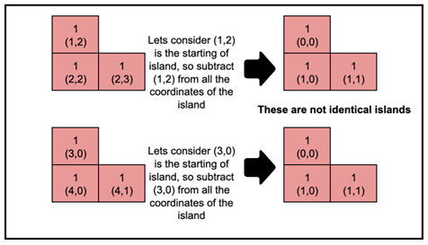
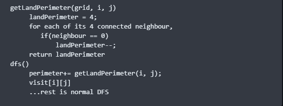
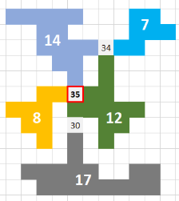
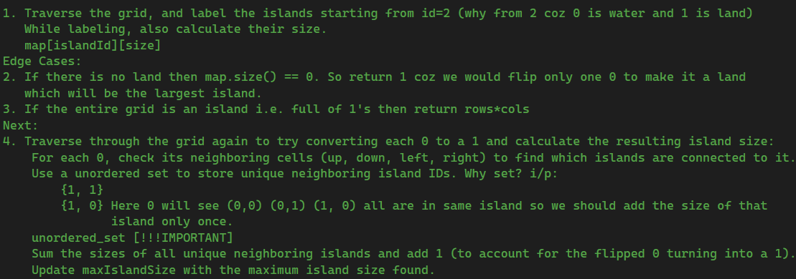

# Graph Topic Order

## Theory
1. BFS 
    Application of BFS 
        1. Path Finding 
        2. Connected Components 
        3. Cycle Detection in undirected and directed graph 
        4. Bipartite Graph 
        5. Shortest Path in Unweighted Graph 
        6. Topological Sorting 
2. DFS
    Types of edges 
        1. Types of edges in Undirected graph - Tree Edge, Back Edge 
        2. Types of edges in Directed graph   - Tree Edge, Forward Edge, Back Edge, Cross Edge  
    Articulation Points 
    Bridges 
    Applications of DFS 
        1. Path Finding 
        2. Connected Components 
        3. Strongly Connected Component 
        4. Cycle Detection in undirected and directed graph 
        5. Bipartite Graph 
        6. Topological Sorting  
3. Path Finding 
    Using BFS
    Using DFS
4. Number of connected components
    Using BFS (Do in Grid and Graph Both)
    Using DFS (Do in Grid and Graph Both)
5. Detect A Cycle in Undirected graph
    Using BFS
    Using DFS
6. Topological sort
    Using Queue + BFS (Kahn's Algo) 
    Using Stack + DFS
7. Detect A Cycle in Directed graph
    Using BFS (Toposort)
    Using DFS (using back edge)
8. Bipartite Graph
    Using BFS
    Using DFS
9. Kosarajus For SCC (2 times DFS)
10. Shortest Path  
    A. Shortest Path in a DAG - Topological Sort 
    B. Shortest Path in undirected graph with unit weights - BFS 
    C. Dijkstra's Algorithm [single source shortest path algorithm (SSSP)] 
    D. Bellman Ford Algorithm [single-source shortest path algorithm (SSSP)] 
    E. Floyd-warshall Algorithm [multisource shortest path algorithm] 
11. MST using Prim's Algo
12. Disjoint set (Union-Find)
    Union by Rank
    Union by size
        Connected Components
        Cycle Detection in Undirected Graph
13. MST using Kruskal's Algo
14. Tarjans For SCC (1 time DFS only)
15. Eulerian path and circuit
16. Maximum Flow
        A. Bridges in graph
        B. Articulation Point/vertex

## 1. Simple DFS/BFS
| Id | Problem | Comment / Urls |
|----|---------|----------------|
| 1 | Number Of Islands |  |
| 2 | Number Of Islands II | TODO in DSU |
| 3 | Number of Distinct Islands	| We need find the shape of the island and save them in an unordered_set. Take a base cell (from where we start dfs) and find the shape using {baseI-i, baseJ-j} for each i and j.|
|   | Max Area of Island| 	Find the size of the largest connected component.|
|   | Battleships in a Board| TODO |
|   | Flood Fill    |  |
|   | Island Perimeter | Simple DFS/BFS. But for a land how to get the sides that have water?  Contribution of land to the total perimeter = number of sides out of its 4 sides that has lands. |
|   | Find if Path Exists in a Graph |  |
|   | Making A Large Island|     |
|   | 0/1 Matrix | |
|   | evaluate-division|  |
|   | keys-and-rooms|  |
|   | get-watched-videos-by-your-friends|  |
|   | detonate-the-maximum-bombs|  |
|   | count-sub-islands|  |

## BFS Variants (0-1 BFS, multi-source BFS)
| Id | Problem | Comment / Urls |
|----|---------|----------------|
|    |Surronded Regions |  |
|    |Shortest Bridge|  |
|    |Number Of Enclaves|  |
|    |Number Of closed Islands|  |
|    |minimum-height-trees| |
|    |minimize-malware-spread| |
|    |minimize-malware-spread-ii| |
|    |maximum-candies-you-can-get-from-boxes| |
|    |word-ladder-1| |
|    |word-ladder-2| |

## Connected Components
| Id | Problem | Comment / Urls |
|----|---------|----------------|
|1   | Graph Valid Tree| |
|2   | Number of Connected Components in an Undirected Graph | |
|3   | Rotting Oranges | |
|    |number-of-provinces| |
|    |redundant-connection| |
|    |redundant-connection-ii| |
|    |most-stones-removed-with-same-row-or-column| |
|    |satisfiability-of-equality-equations| |
|    |rank-transform-of-a-matrix| |
|    |number-of-operations-to-make-network-connected| |
|    |remove-max-number-of-edges-to-keep-graph-fully-traversable| |
|    |checking-existence-of-edge-length-limited-paths| |
|    |process-restricted-friend-requests| |
|    |find-all-people-with-secret| |
|    |count-unreachable-pairs-of-nodes-in-an-undirected-graph| |
|    |minimum-score-of-a-path-between-two-cities| |
|    |count-the-number-of-complete-components| |

## Count Degrees
| Id | Problem | Comment / Urls |
|----|---------|----------------|
|    |find-the-town-judge| |
|    |minimum-number-of-vertices-to-reach-all-nodes| |
|    |maximal-network-rank| |
|    |minimum-degree-of-a-connected-trio-in-a-graph| |
|    |count-pairs-of-nodes| |
|    |find-center-of-star-graph| |
|    |maximum-total-importance-of-roads| |
|    |node-with-highest-edge-score| |
|    |maximum-star-sum-of-a-graph| |
|    |add-edges-to-make-degrees-of-all-nodes-even| |
|    |find-champion-ii| |

## Cycle Detection
| Id | Problem | Comment / Urls |
|----|---------|----------------|
|    |largest-color-value-in-a-directed-graph|    |
|    |maximum-employees-to-be-invited-to-a-meeting|    |
|    |find-closest-node-to-given-two-nodes|    |
|    |longest-cycle-in-a-graph|    |
|    |shortest-cycle-in-a-graph|    |
|    |count-visited-nodes-in-a-directed-graph|    |

## Topological Sorting
| Id | Problem | Comment / Urls |
|----|---------|----------------|
|    |course-schedule|    |
|    |course-schedule-ii|    |
|    |course-schedule-iii|    |
|    |course-schedule-iv|    |
|    |Parallel Courses|    |
|    |all-paths-from-source-to-target|    |
|    |find-eventual-safe-states|    |
|    |sort-items-by-groups-respecting-dependencies|    |
|    |all-ancestors-of-a-node-in-a-directed-acyclic-graph|    |
|    |course-schedule-iv|    |
|    |strange-printer-ii|    |
|    |parallel-courses-iii|    |
|    |find-all-possible-recipes-from-given-supplies|    |
|    |build-a-matrix-with-conditions|    |
|    |alien dictionary| |
|    |Sequence Reconstruction| |

## Connected Component/Union Find (Disjoint-set)
| Id | Problem | Comment / Urls |
|----|---------|----------------|
|    |number-of-provinces|    |
|    |redundant-connection|    |
|    |redundant-connection-ii|    |
|    |most-stones-removed-with-same-row-or-column|    |
|    |satisfiability-of-equality-equations|    |
|    |rank-transform-of-a-matrix|    |
|    |number-of-operations-to-make-network-connected|    |
|    |remove-max-number-of-edges-to-keep-graph-fully-traversable|    |
|    |checking-existence-of-edge-length-limited-paths|    |
|    |process-restricted-friend-requests|    |
|    |find-all-people-with-secret|    |
|    |count-unreachable-pairs-of-nodes-in-an-undirected-graph|    |
|    |minimum-score-of-a-path-between-two-cities|    |
|    |count-the-number-of-complete-components|    |
|    |account-merge|  |

## Bipartite
| Id | Problem | Comment / Urls |
|----|---------|----------------|
|    |is-graph-bipartite|    |
|    |possible-bipartition|    |

## Shortest Path - Dijkstra Algorithm
| Id | Problem | Comment / Urls |
|----|---------|----------------|
|    |shortest-distance-in-binary-maze |  |
|    |path-with-minimum-effort |  |
|    |cheapest-flights-with-k-stops |  |
|    |minimum-multiplication-to-read-end |  |
|    |number of ways to arrive at destination |  |
|    |network-delay-time |  |
|    |reachable-nodes-in-subdivided-graph|    |
|    |path-with-maximum-probability|    |
|    |minimum-cost-to-make-at-least-one-valid-path-in-a-grid|    |
|    |number-of-restricted-paths-from-first-to-last-node|    |
|    |minimum-cost-to-reach-destination-in-time|    |
|    |number-of-ways-to-arrive-at-destination|    |
|    |the-time-when-the-network-becomes-idle|    |
|    |second-minimum-time-to-reach-destination|    |
|    |minimum-weighted-subgraph-with-the-required-paths|    |
|    |minimum-obstacle-removal-to-reach-corner|    |
|    |minimum-cost-of-a-path-with-special-roads|    |
|    |minimum-time-to-visit-a-cell-in-a-grid|    |
|    |modify-graph-edge-weights|    |
|    |swim in rising water |  |

## Shortest Path - Bellman–Ford Algorithm
| Id | Problem | Comment / Urls |
|----|---------|----------------|
|    |shortest-path-with-alternating-colors|    |
|    |cheapest-flights-within-k-stops|    |

## Shortest Path - Floyd–Warshall Algorithm
| Id | Problem | Comment / Urls |
|----|---------|----------------|
|    |find-the-city-with-the-smallest-number-of-neighbors-at-a-threshold-distance|    |
|    |design-graph-with-shortest-path-calculator|    |
|    |number-of-possible-sets-of-closing-branches|    |
|    |minimum-cost-to-convert-string-i|    |
|    |minimum-cost-to-convert-string-ii|    |
|    |count-the-number-of-houses-at-a-certain-distance-i|    |

## Minimum Spanning Tree - Kruskal's Algorithm
| Id | Problem | Comment / Urls |
|----|---------|----------------|
|    |find-critical-and-pseudo-critical-edges-in-minimum-spanning-tree|    |
|    |min-cost-to-connect-all-points|    |

## Euler Tour
| Id | Problem | Comment / Urls |
|----|---------|----------------|
|    |reconstruct-itinerary|    |
|    |valid-arrangement-of-pairs|    |

## De Bruijn Sequence
| Id | Problem | Comment / Urls |
|----|---------|----------------|
|    |cracking-the-safe|    |

## Game on Graph
| Id | Problem | Comment / Urls |
|----|---------|----------------|
|    |cat-and-mouse|    |
|    |cat-and-mouse-ii|    |

## Graph Cloning
| Id | Problem | Comment / Urls |
|----|---------|----------------|
|    |clone-graph|    |

## Construction
| Id | Problem | Comment / Urls |
|----|---------|----------------|
|    |maximum-score-of-a-node-sequence|    |
|    |couples-holding-hands|    |

## Hamilton Cycle/Travelling Sellsman
| Id | Problem | Comment / Urls |
|----|---------|----------------|
|    |shortest-path-visiting-all-nodes|    |

## Tarjan's Algorithm
| Id | Problem | Comment / Urls |
|----|---------|----------------|
|    |critical-connections-in-a-network|    |

## DP applications
| Id | Problem | Comment / Urls |
|----|---------|----------------|
|    |maximum-path-quality-of-a-graph|    |
|    |parallel-courses-ii|    |
|    |flower-planting-with-no-adjacent|    |
|    |loud-and-rich|    |
|    |longest-increasing-path-in-a-matrix|    |
|    |number-of-increasing-paths-in-a-grid|    |

## Ad-Hoc
| Id | Problem | Comment / Urls |
|----|---------|----------------|
|    |number-of-ways-to-reconstruct-a-tree|    |
|    |divide-nodes-into-the-maximum-number-of-groups|    |
|    |count-the-number-of-houses-at-a-certain-distance-ii|    |
|    |Decode String|    |
|    |Ternary Expression Parser|    |
|    |Pacific Atlantic Water Flow|    |
|    |Concatenated Words|    |
|    |Target Sum	|    |
|    |Matchsticks to Square|    |
|    |The Maze|    |
|    |The Maze II|    |
|    |The Maze III|    |
|    |House Robber I|    |
|    |House Robber II|    |
|    |House Robber III|    |
|    |Nested List Weight Sum|    |
|    |Nested List Weight Sum II|    |
|    |Increasing Subsequences	|    |
|    |All Paths from Source Lead to Destination|    |
|    |Longest Increasing Path in a Matrix|    |
|    |Path with Maximum Gold|    |
|    |Check if There is a Valid Path in a Grid|    |
|    |Minesweeper|    |
|    |Lonely Pixel I|    |
|    |Lonely Pixel II|    |
|    |Friend Circles	|    |
|    |Out of Boundary Paths	|    |
|    |Employee Importance	|    |
|    |Sentence Similarity I	|    |
|    |Sentence Similarity II|    |
|    |Similar String Groups|    |
|    |Web Crawler|    |
|    |Remove minimum number of Invalid Parenthesis|    |
|    |Reorder routes to make all paths lead to the city zero |  |
|    |snakes and ladders |  |
|    |open the lock |  |

