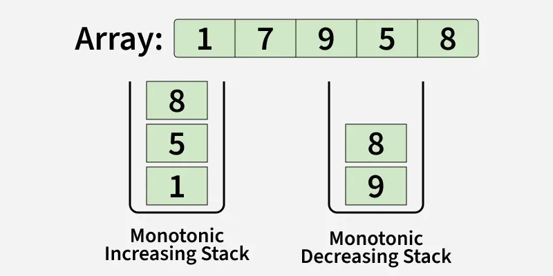

# Stack

## Patterns
1. Implementation
2. Monotonic Stack
3. Parenthesis
4. Expression & Parser

## Pattern 2: Monotonic Stack
A monotonic stack is a stack that maintains its elements in a fixed order either increasing or decreasing.

When a new element is pushed, it is compared with the top of the stack. If the order is violated, elements are popped until the property is restored, and then the new element is pushed.

This way, the stack always stays ordered, and since each element is pushed and popped at most once, the overall operations run in linear time.

A. Monotonic Increasing Stack 
B. Monotonic Decreasing Stack

### 1. Next Greater Element To Right
